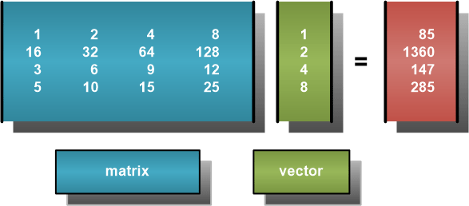

**Easy OpenCL with Python**

**原文地址:**
<http://www.drdobbs.com/open-source/easy-opencl-with-python/240162614>

By [Gastón Hillar](http://www.drdobbs.com/authors/Gaston-Hillar) and Gaston
Hillar, October 15, 2013

**Post a Comment**

**Use OpenCL with very little code -- and test it from the Python console.**

PyOpenCL is an open-source package (MIT license) that enables developers to
easily access the OpenCL API from Python. The latest stable version of PyOpenCL
provides features that make it one of the handiest OpenCL wrappers for Python
because you can easily start working with OpenCL kernels without leaving your
favorite Python environment. In this first article of a two-part series on
PyOpenCL, I explain how you can easily build and deploy an OpenCL kernel, that
is, a function that executes on the GPU device.

**More Than an OpenCL Wrapper**

PyOpenCL enables you to access the entire OpenCL 1.2 API from Python. Thus, you
are able to retrieve all the information that the OpenCL API offers for
platforms, contexts, devices, programs, kernels, and command queues. One of the
main goals of PyOpenCL is to make sure that you can access in Python the same
features that a C++ OpenCL host program can. However, PyOpenCL is not just an
OpenCL wrapper for Python: It also provides enhancements and shortcuts for the
most common tasks. With PyOpenCL, you usually need only a few lines of Python
code to perform tasks that require dozens of C++ lines.

PyOpenCL reduces the number of OpenCL calls needed to retrieve all the
information usually required to build and deploy a kernel for OpenCL execution
on the GPU device. It provides automatic object cleanup tied to the lifetime of
objects, so you don't need to worry about writing cleanup code. And PyOpenCL
automatically translates all OpenCL errors to Python exceptions.

You can use PyOpenCL to create programs and build kernels as you would with a
C++ OpenCL host program, or you can take advantage of the many OpenCL kernel
builders that simplify the creation of kernels that need to perform common
parallel algorithms. PyOpenCL provides kernel builders for the following
parallel algorithms:

-   Element-wise expression evaluation builder (map)

-   Sum and counts builder (reduce)

-   Prefix sums builder (scan)

-   Custom scan kernel builder

-   Radix sort

**Gathering Information About Platforms, Contexts, and Devices**

You probably have some basic knowledge of how OpenCL works and the it organizes
the underlying drivers and hardware, such as platforms, contexts, and devices.
If not, I suggest Matthew Scarpino's [A Gentle Introduction to
OpenCL](http://www.drdobbs.com/parallel/a-gentle-introduction-to-opencl/231002854),
which is a good introductory tutorial; you will then be able to understand the
examples I provide in this series. Scarpino's analogy of OpenCL processing and a
game of cards makes it easy to understand the way OpenCL works.

One of the problems I found in the good documentation provided by PyOpenCL is
that it assumes you have just one OpenCL platform available in your development
workstation. Sometimes, you have more than one platform. For example, in my
laptop I have two OpenCL platforms:

-   AMD Accelerated Parallel Processing: The drivers for my ATI GPU, which
    include support for OpenCL.

-   Intel OpenCL: The Intel OpenCL runtime which provides a CPU-only OpenCL
    runtime for my Intel Core i7 CPU.

Thus, it is good practice to prepare your code to run on computers that might
have more than one OpenCL platform. If you want to easily check the different
OpenCL platforms available in any computer, you can use a simple and useful
utility to list them and check their features, [GPU Caps
Viewer.](http://www.geeks3d.com/20130618/gpu-caps-viewer-1-18-1-videocard-information-utility-opengl-opencl-geforce-radeon-gpu/)Download
the latest version of GPU Caps Viewer and then read about its features in [GPU
Caps Viewer v1.8.6 Dives Deep on OpenCL
Support](http://www.drdobbs.com/parallel/gpu-caps-viewer-v186-dives-deep-on-openc/228800376).
It is wise to learn about the OpenCL features that are available in your
development workstation before you start diving deeper into PyOpenCL.

I'll use the import pyopencl as cl import for all the code snippets in this
article. If you want to retrieve all the OpenCL platforms, you can use platforms
= cl.get_platforms().

The get_platforms() method returns a list of pyopencl.Platform instances that
include all the information you need about each platform. In my case,
get_platforms returns a list with two instances, and the pyopencl.Platform
instances have the following values for their name property: 'AMD Accelerated
Parallel Processing' and 'Intel(R) OpenCL'.

A common requirement for OpenCL host programming is to obtain different platform
information parameters, such as the list of extensions supported by the
platform. In C++, retrieving this information requires many lines of code.
PyOpenCL makes it easier because each pyopencl.Platform instance includes all
the properties you might need to check. Table 1 shows the pyopencl.Platform
property names that provide the equivalent information to an OpenCL platform
parameter name. As you can see, you just need to remove the CL_PLATFORM\_ prefix
and use lowercase letters to generate the equivalent property name.

| **OpenCL Platform Parameter Name** | **pyopencl.Platform Property Name** | **Description**                                                                                                                                                                           |
|------------------------------------|-------------------------------------|-------------------------------------------------------------------------------------------------------------------------------------------------------------------------------------------|
| CL_PLATFORM_EXTENSIONS             | extensions                          | A string with the list of extensions supported by the platform.                                                                                                                           |
| CL_PLATFORM_NAME                   | name                                | A string with the platform's name.                                                                                                                                                        |
| CL_PLATFORM_PROFILE                | profile                             | A string with two possible values: 'FULL_PROFILE' when the platform supports the full OpenCL standard or 'EMBEDDED_PROFILE' when the platform just supports the embedded OpenCL standard. |
| CL_PLATFORM_VENDOR                 | vendor                              | A string with the platform's vendor name.                                                                                                                                                 |
| CL_PLATFORM_VERSION                | version                             | A string with the maximum version of the OpenCL API supported by the platform.                                                                                                            |

**Table 1. PyOpenCL property names**

For example, the following line retrieves a string with the list of extensions
supported by the first OpenCL platform found. Because you need at least one
OpenCL platform to be able to work with PyOpenCL and OpenCL, the line will work
on any OpenCL development workstation:

?

| 1 | platform_extensions =platforms[0].extensions |
|---|----------------------------------------------|

The following lines show examples of the string value of the extensions property
for two different platforms:

?

| 1 2 | 'cl_khr_icd cl_amd_event_callback cl_amd_offline_devices cl_khr_d3d10_sharing' 'cl_khr_fp64 cl_khr_icd cl_khr_global_int32_base_atomics cl_khr_global_int32_extended_atomics cl_khr_local_int32_base_atomics cl_khr_local_int32_extended_atomics cl_khr_byte_addressable_store cl_intel_printf cl_ext_device_fission cl_intel_exec_by_local_thread cl_khr_gl_sharing cl_intel_dx9_media_sharing cl_khr_dx9_media_sharing cl_khr_d3d11_sharing' |
|-----|------------------------------------------------------------------------------------------------------------------------------------------------------------------------------------------------------------------------------------------------------------------------------------------------------------------------------------------------------------------------------------------------------------------------------------------------|

You can check whether the platform supports the cl_khr_icd extension with the
following line:

?

| 1 | supports_cl_khr_icd =platform_extensions.__contains__('cl_khr_icd') |
|---|---------------------------------------------------------------------|

Now that you have a platform, you can access devices that can receive tasks and
data from the host. If you want to retrieve all the OpenCL devices available for
a specific platform, you can call the get_devices method for the
pyopencl.Platform instance. For example, the following line retrieves all the
devices for the first OpenCL platform found:

?

| 1 | devices =platforms[0].get_devices() |
|---|-------------------------------------|

The get_devices() method returns a list of pyopencl.Device instances that
include all the information you need about each device. When you call
get_devices() without parameter, it is equivalent to the following line that
retrieves devices without filtering by device type:

?

| 1 | devices =platforms[0].get_devices(cl.device_type.ALL) |
|---|-------------------------------------------------------|

For example, in my case, when I don't specify the desired device type,
get_devices() returns a list with two instances of the pyopencl.Device class —
one for the GPU, and the other for the CPU. If you only want to retrieve the
available GPU devices, you can specify the desired filter:

?

| 1 | gpu_devices =platforms[0].get_devices(cl.device_type.GPU) |
|---|-----------------------------------------------------------|

As with the platforms, PyOpenCL makes it easy to obtain different device
information parameters, such as the device's global memory size. Each
pyopencl.Device instance includes all the properties you might need to check.
Table 2 shows some of the pyopencl.Device property names that provide the
equivalent information to an OpenCL platform parameter name. As you can see, you
just need to remove the CL_DEVICE\_ prefix and use lowercase letters to generate
the equivalent property name.

| **OpenCL Device Parameter Name** | **pyopencl.Device Property Name** | **Description**                                                          |
|----------------------------------|-----------------------------------|--------------------------------------------------------------------------|
| CL_DEVICE_ADDRESS_BITS           | address_bits                      | An unsigned integer with the size of the device's address space.         |
| CL_DEVICE_EXTENSIONS             | extensions                        | A string with the list of extensions supported by the device.            |
| CL_DEVICE_GLOBAL_MEM_SIZE        | global_mem_size                   | An unsigned long with the size of the device's global memory             |
| CL_DEVICE_MAX_WORK_GROUP_SIZE    | max_work_group_size               | An unsigned integer with the maximum size of a workgroup for the device. |
| CL_DEVICE_NAME                   | name                              | A string with the device's name.                                         |
| CL_DEVICE_VENDOR                 | vendor                            | A string with the device's vendor name.                                  |

**Table 2. Typical device properties returned in PyOpenCL**

The following line retrieves a string with the list of extensions supported by
the first OpenCL GPU device in the selected platform. You need at least one
OpenCL GPU device to run the next line in any OpenCL development workstation:

?

| 1 | gpu_device_extensions =gpu_devices[0].extensions |
|---|--------------------------------------------------|

The following line shows examples of the string value of the extensions property
for one device:

?

| 1 | 'cl_khr_gl_sharing cl_amd_device_attribute_query cl_khr_d3d10_sharing' |
|---|------------------------------------------------------------------------|

You can check whether the device supports the cl_khr_gl_sharing extension with
the following line:

?

| 1 | supports_cl_khr_gl_sharing =gpu_device_extensions.__contains__('cl_khr_gl_sharing') |
|---|-------------------------------------------------------------------------------------|

It is very common to check some extensions related to graphics for a device,
such as cl_khr_d3d10_sharing and cl_khr_gl_sharing. If you've ever written a
OpenCL host application in C++, you will definitely notice how much simpler
things are with PyOpenCL.

**Building and Deploying a Kernel**

To build and deploy a basic OpenCL kernel, you usually need to follow these
steps in a typical OpenCL C++ host program:

1.  Obtain an OpenCL platform.

2.  Obtain a device id for at least one device (accelerator).

3.  Create a context for the selected device or devices.

4.  Create the accelerator program from source code.

5.  Build the program.

6.  Create one or more kernels from the program functions.

7.  Create a command queue for the target device.

8.  Allocate device memory and move input data from the host to the device
    memory.

9.  Associate the arguments to the kernel with kernel object.

10. Deploy the kernel for device execution.

11. Move the kernel's output data to host memory.

12. Release context, program, kernels and memory.

These steps represent a simplified version of the tasks that your host program
must perform (each step is a bit more complex in real life). For example, the
first step (obtain an OpenCL platform) usually requires checking the properties
for the platforms, as I explained in the previous section. In addition, each
step requires error checking. Because you can work with PyOpenCL from any Python
console, you can execute the different steps with an interactive environment
that makes it easy for you to learn both OpenCL and the way PyOpenCL exposes the
features in the API.

**Use OpenCL with very little code -- and test it from the Python console.**

As an example, I'll use the 12 steps to build and deploy a kernel with PyOpenCL.
This way, if you have experience with C++ OpenCL host applications, you will be
able to use PyOpenCL to prepare your host applications to build and deploy your
OpenCL kernels.

The following lines show the code for an OpenCL kernel that computes the product
of a matrix and a vector:

*?*

| 1 2 3 4 5 6 | \__kernel void matrix_dot_vector(__global const float4 **\***matrix,         __global const float4 **\***vector, \__global float **\***result) {     int gid **=** get_global_id(0);     result[gid] **=** dot(matrix[gid], vector[0]); } |
|-------------|-------------------------------------------------------------------------------------------------------------------------------------------------------------------------------------------------------------------------------------------|

Both the matrix and vector kernel arguments are of type float4 and are stored in
the device's global address space, also known as "global memory." The kernel
code retrieves the global ID number (gid) and uses it to calculate the product
of the float4 matrix row whose index is equal to the global ID number and
the float4 vector. The float result is stored in the global ID number index
of result. Figure 1 shows an example of a 4-by-4 matrix multiplied by a
4-element vector.

**Figure 1: A 4x4 matrix multiplied by a 4-element vector with the result.**

The matrix-vector multiplication shown in Figure 1 requires the following
operations:

1 \* 1 + 2 \* 2 + 4 \* 4 + 8 \* 8 = 85 16 \* 1 + 32 \* 2 + 64 \* 4 + 128 \* 8 =
1360 3 \* 1 + 6 \* 2 + 9 \* 4 + 12 \* 8 = 147 5 \* 1 + 10 \* 2 + 15 \* 4 +25 \*
8 = 285

Each row in the matrix is a float4 vector, so the kernel performs just one
operation to compute the product of one row and the float4 vector. For example,
the first matrix row is (1.0, 2.0, 4.0, 8.0) and the only element of vector
is (1.0, 2.0, 4.0, 8.0). The dot operation for the first matrix row will have
two arguments with 4 float values packed in each argument: (1.0, 2.0, 4.0,
8.0)for matrix[gid], and (1.0, 2.0, 4.0, 8.0) for vector[0]. The code takes
advantage of the vector processing capabilities of OpenCL and demonstrates the
support for vector types that PyOpenCL provides to Python.

The following lines show Python code that uses PyOpenCL
and [Numpy](http://www.numpy.org/) to perform the steps required for an OpenCL
host program. The code includes comments that indicate which blocks of code are
performing each of the 12 steps of the typical OpenCL C++ host program. You can
also run different parts of the code in the Python console.

*?*

| 1 2 3 4 5 6 7 8 9 10 11 12 13 14 15 16 17 18 19 20 21 22 23 24 25 26 27 28 29 30 31 32 33 34 35 36 37 38 39 40 41 42 43 44 45 46 47 48 49 50 51 52 53 54 55 56 57 58 59 60 61 62 | **import** pyopencl as cl **from** pyopencl **import** array **import** numpy  **if** \__name_\_ **==** "__main__":     vector **=** numpy.zeros((1, 1), cl.array.vec.float4)     matrix **=** numpy.zeros((1, 4), cl.array.vec.float4)     matrix[0, 0] **=** (1, 2, 4, 8)     matrix[0, 1] **=** (16, 32, 64, 128)     matrix[0, 2] **=** (3, 6, 9, 12)     matrix[0, 3] **=** (5, 10, 15, 25)     vector[0, 0] **=** (1, 2, 4, 8)     \#\# Step \#1. Obtain an OpenCL platform.     platform **=** cl.get_platforms()[0]     \#\# It would be necessary to add some code to check the check the support for     \#\# the necessary platform extensions with platform.extensions     \#\# Step \#2. Obtain a device id for at least one device (accelerator).     device **=** platform.get_devices()[0]     \#\# It would be necessary to add some code to check the check the support for     \#\# the necessary device extensions with device.extensions     \#\# Step \#3. Create a context for the selected device.     context **=** cl.Context([device])     \#\# Step \#4. Create the accelerator program from source code.     \#\# Step \#5. Build the program.     \#\# Step \#6. Create one or more kernels from the program functions.     program **=** cl.Program(context, """         __kernel void matrix_dot_vector(__global const float4 \*matrix,         __global const float4 \*vector, \__global float \*result)         {           int gid = get_global_id(0);           result[gid] = dot(matrix[gid], vector[0]);         }         """).build()     \#\# Step \#7. Create a command queue for the target device.     queue **=** cl.CommandQueue(context)     \#\# Step \#8. Allocate device memory and move input data from the host to the device memory.     mem_flags **=** cl.mem_flags     matrix_buf **=** cl.Buffer(context, mem_flags.READ_ONLY \| mem_flags.COPY_HOST_PTR, hostbuf**=**matrix)     vector_buf **=** cl.Buffer(context, mem_flags.READ_ONLY \| mem_flags.COPY_HOST_PTR, hostbuf**=**vector)     matrix_dot_vector **=** numpy.zeros(4, numpy.float32)     destination_buf **=** cl.Buffer(context, mem_flags.WRITE_ONLY, matrix_dot_vector.nbytes)     \#\# Step \#9. Associate the arguments to the kernel with kernel object.     \#\# Step \#10. Deploy the kernel for device execution.     program.matrix_dot_vector(queue, matrix_dot_vector.shape, None, matrix_buf, vector_buf, destination_buf)     \#\# Step \#11. Move the kernel’s output data to host memory.     cl.enqueue_copy(queue, matrix_dot_vector, destination_buf)     \#\# Step \#12. Release context, program, kernels and memory.     \#\# PyOpenCL performs this step for you, and therefore,     \#\# you don't need to worry about cleanup code     print(matrix_dot_vector) |
|----------------------------------------------------------------------------------------------------------------------------------------------------------------------------------|------------------------------------------------------------------------------------------------------------------------------------------------------------------------------------------------------------------------------------------------------------------------------------------------------------------------------------------------------------------------------------------------------------------------------------------------------------------------------------------------------------------------------------------------------------------------------------------------------------------------------------------------------------------------------------------------------------------------------------------------------------------------------------------------------------------------------------------------------------------------------------------------------------------------------------------------------------------------------------------------------------------------------------------------------------------------------------------------------------------------------------------------------------------------------------------------------------------------------------------------------------------------------------------------------------------------------------------------------------------------------------------------------------------------------------------------------------------------------------------------------------------------------------------------------------------------------------------------------------------------------------------------------------------------------------------------------------------------------------------------------------------------------------------------------------------------------------------------------------------------------------------------------------------------------------------------------------------------------------------------------------------------------------------------------------------------------------------------------------------------------------------------------------------------------------------------------------------------------------------------------------------------------------------------------------------------------------------------------------------------------------------------------------------------------------------------------------------------------------------------------------------------------------------------------------------------------------------------------------------------------------------------------------------------------------------------------------------------------------------------------------------------------------------------------------------|

The first lines create two variables that initialize both the matrix and the
vector. Notice that vector is an array of cl.array.vec.float4 with a single
element and matrix is an array of cl.array.vec.float4 with four elements. I
used numpy.zeros to create the array with the cl.array.vec.float4 type and then
additional code to initialize the values shown in Figure 1. This way, you can
easily understand the way you can use cl.array.vec types:

*?*

| 1 2 3 4 5 6 7 | vector **=** numpy.zeros((1, 1), cl.array.vec.float4) matrix **=** numpy.zeros((1, 4), cl.array.vec.float4) matrix[0, 0] **=** (1, 2, 4, 8) matrix[0, 1] **=** (16, 32, 64, 128) matrix[0, 2] **=** (3, 6, 9, 12) matrix[0, 3] **=** (5, 10, 15, 25) vector[0, 0] **=** (1, 2, 4, 8) |
|---------------|--------------------------------------------------------------------------------------------------------------------------------------------------------------------------------------------------------------------------------------------------------------------------------------|

The code retrieves the first available platform, then the first device for this
platform. There is no code to check either the available extensions or the
device type. However, I placed comments in the code as a reminder that these
tasks are necessary in a more complex host program.

Then, the code creates an OpenCL context for the selected device and
calls cl.Program to create a program for the context with the kernel source code
as one of the arguments. The call to the build() method for the
created cl.Program instance builds the kernel.

The code calls cl.CommandQueue with the context as an argument to create a
command queue (queue) for the target device. Then, it allocates device memory
and moves input data from the host to the device memory. The following lines use
the most basic features provided by PyOpenCL to do this:

*?*

| 1 2 3 4 5 | mem_flags **=** cl.mem_flags matrix_buf **=** cl.Buffer(context, mem_flags.READ_ONLY \| mem_flags.COPY_HOST_PTR, hostbuf**=**matrix) vector_buf **=** cl.Buffer(context, mem_flags.READ_ONLY \| mem_flags.COPY_HOST_PTR, hostbuf**=**vector) matrix_dot_vector **=** numpy.zeros(4, numpy.float32) destination_buf **=** cl.Buffer(context, mem_flags.WRITE_ONLY, matrix_dot_vector.nbytes) |
|-----------|---------------------------------------------------------------------------------------------------------------------------------------------------------------------------------------------------------------------------------------------------------------------------------------------------------------------------------------------------------------------------------------------|

The code defines the following buffers by calling cl.Buffer:

-   matrix_buf. A read-only buffer that copies the data from
    the matrix variable. The kernel will read from this buffer in the global
    memory space

-   vector_buf. A read-only buffer that copies the data from
    the vector variable. The kernel will read from this buffer in the global
    memory space

-   destination_buf: A write-only buffer that will hold the result of the
    matrix-by-vector multiplication. The kernel will write to this buffer in the
    global memory space

The following line associates the arguments to the kernel and deploys it for
device execution by calling the method that PyOpenCL generates in program with
the built kernel name: matrix_dot_vector. The previously created queue is the
first argument:

*?*

| 1 | program.matrix_dot_vector(queue, matrix_dot_vector.shape, None, matrix_buf, vector_buf, destination_buf) |
|---|----------------------------------------------------------------------------------------------------------|

The kernel receives the following arguments:

-   matrix_buf for matrix

-   vector_buf for vector

-   destination_buf for result

When the kernel finishes, it is time to move the kernel's output data (result)
stored in destination_buf to the host program memory. The following line
calls cl.enqueue_copy to do this, and the result will be available in
the matrix_dot_vector variable.

*?*

| 1 | cl.enqueue_copy(queue, matrix_dot_vector, destination_buf) |
|---|------------------------------------------------------------|

In this example, the code doesn't take advantage of the different events that
are fired when the kernel finishes its execution. That notwithstanding, because
PyOpenCL performs all the necessary cleanup operations, you don't need to worry
about reference counts or releasing the underlying OpenCL structures and
resources.

**Conclusion**

This example shows basic features that PyOpenCL provides to Python developers
who want to create OpenCL host applications. In the next article in this series,
I'll dive deep into more advanced features that reduce the code required to
build and deploy OpenCL kernels for many common parallel algorithms.

*Gaston Hillar is a frequent contributor to *Dr. Dobb's.
